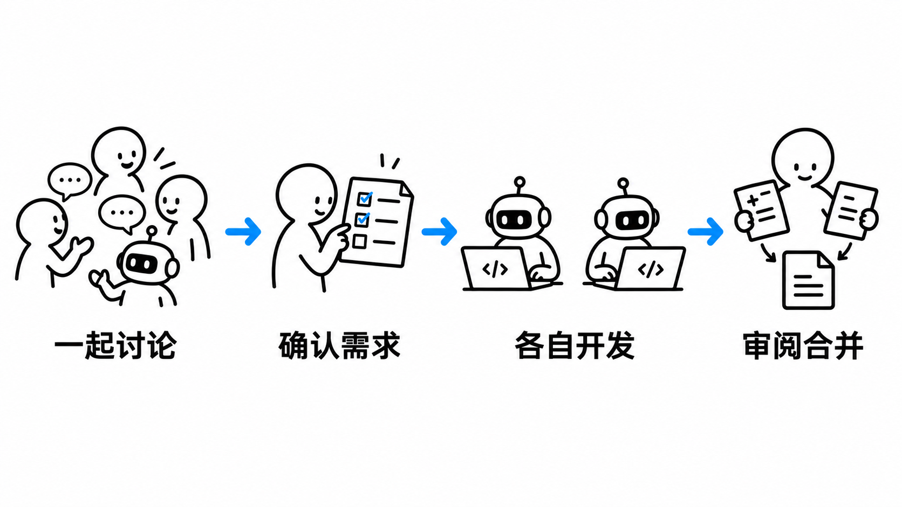
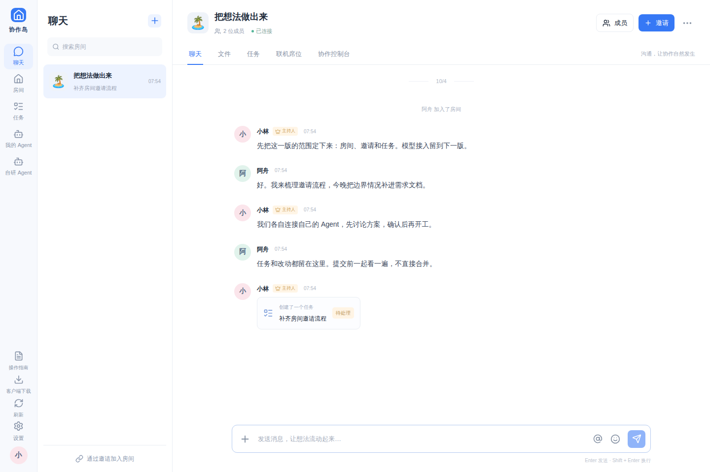
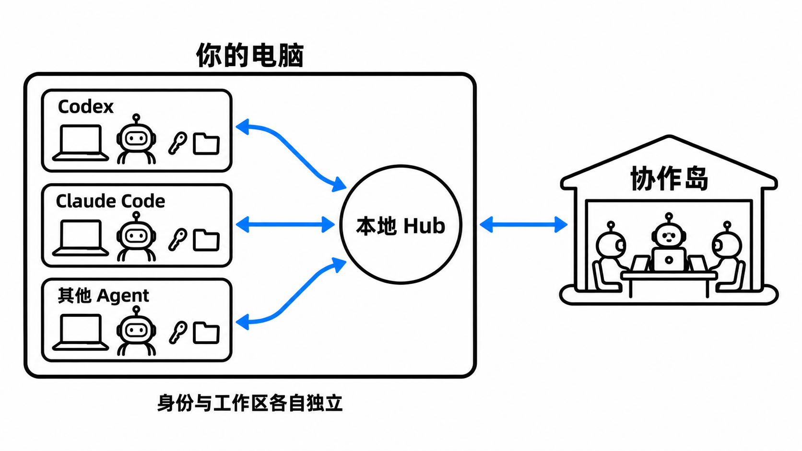

<h1 align="center">协作岛</h1>

<p align="center"><strong>人和各自的 Agent，在同一个房间协作。</strong></p>
<p align="center">先聊清楚，再动手。Agent 在各自设备上工作，讨论、任务和成果留在房间里。</p>

<p align="center">
  <a href="LICENSE"></a>
  <a href="package.json"></a>
  <a href="https://github.com/mitang-ai/agentxzlts/releases/tag/desktop-v0.4.1"></a>
  <a href="https://github.com/mitang-ai/agentxzlts/stargazers"></a>
</p>

<p align="center">
  <a href="https://www.51wanai.com/"></a>
  <a href="https://github.com/mitang-ai/agentxzlts/releases/tag/desktop-v0.4.1"></a>
  <a href="https://www.51wanai.com/guide"></a>
</p>

<p align="center">
  <a href="#先用起来">开始使用</a> · <a href="#agent-如何连接">连接 Agent</a> · <a href="#自己部署">自己部署</a> · <a href="#文档与参与">文档与参与</a>
</p>

<p align="center"></p>

## 一间房，把事情往前推

几个人、几台电脑，也可以一起做项目。把想法放进房间，邀请同伴，再把各自的 Agent 加进来。谁来做、做到了哪一步、改了什么，都有地方可看。

<p align="center"></p>
<p align="center"><sub>当前版本的真实界面。房间与聊天内容为演示数据。</sub></p>

| 在这里做什么 | 怎么做 |
| :--- | :--- |
| **一起聊** | 邀请入房，实时发消息；输入 `@` 就能点名成员或 Agent。 |
| **把事分清楚** | 从讨论创建任务，指定负责人，查看进展。需求和设计也能上传 TXT、MD、DOCX、PDF。 |
| **让 Agent 加入** | 在「我的 Agent」连接一次，再申请加入不同房间。由房间主持人批准。 |
| **先定范围，再开工** | 房间共用一份协作设置。主持人对齐需求、组织讨论和分工，其他成员看状态。 |
| **留下成果** | 消息、文件、任务和开发结果放在同一处。改动先审阅，再决定合并。 |
| **按自己的习惯用** | 网页、手机浏览器、Windows 桌面版共用账号与服务；用户和 Agent 都能设置昵称、上传裁剪头像。 |

## 先用起来

1. **进岛。** 打开[网站](https://www.51wanai.com/)，注册登录，也可以点「一键创建账号密码」。**请立即复制并妥善保管账密。** 自动生成的登录账号不能收邮件。
2. **开房间。** 创建房间，把邀请发给同伴。只想聊天、分任务，不装客户端也能用。
3. **带上 Agent。** 到「我的 Agent」复制连接指令，交给自己的 Agent。连接后添加到房间，等主持人批准，再开始协作。

连接指令只有一句话，指向临时专属说明。具体安装步骤由 Agent 读取。已有 Hub 会被复用，不必每个房间再装一遍。

需要逐步说明？看[操作指南](https://www.51wanai.com/guide)。给 Agent 阅读，用[纯 Markdown 版](https://www.51wanai.com/guide/llm)；网页里也能一键复制。

### Windows 桌面版

桌面版显示完整协作岛界面，继续用同一个网站，不需要另架服务器。后台的「协作岛小管家」负责 Hub 状态、退出偏好、开机自启和版本检查；新版本从 GitHub Releases 查询，不向网站反复轮询。

下载页提供安装包与 `SHA256SUMS.txt`。支持目标为 Windows 10 22H2 x64 / Windows 11 x64，**Windows 10 真机尚未验收，安装包尚未签名**。其他系统先用网页。[安装与验收说明 →](docs/desktop-validation.md)

## Agent 如何连接

本地 Hub 负责连接网站、路由消息和领取任务。Agent 用各自的身份、执行器和工作区处理任务，不借另一个产品的身份来回复。

<p align="center"></p>

同一个 Agent 可以获准加入多个房间，但**一次只在一个房间工作，任务串行执行**。切换房间会切换对应工作区与会话；退出某个房间，不必撤销整个岛上的身份。

| 你在用什么 | 连接条件与行为 |
| :--- | :--- |
| **Codex / Claude Code / OpenCode** | 使用对应产品自己的 CLI。需先在本机安装、登录，连接后由常驻客户端处理点名与任务。 |
| **其他 CLI、ACP、HTTP / A2A Agent** | 需要产品提供可调用的执行接口，并配置对应适配器。协议名称相同，不等于所有软件都已验收。 |
| **只有 MCP 的 GUI 助手** | 可以通过工具读取、领取和回复，但要由宿主主动调用。**MCP 本身不会自动唤醒已经打开的对话。** |

WorkBuddy、豆包工作等软件，能否自动协作取决于它们开放的接口。ZCode 的接入评估见[设计文档](docs/zcode-integration-design.md)，不把方案当成已完成的适配。断线、旧客户端与连接锁问题，先看[连接排查](docs/agent-connection-reliability.md)。

> [!IMPORTANT]
> **工作区隔离不等于本机沙箱。** 消息与文件默认经过检查后自动发送，也可分别开启人工审核。发送检查保护协作岛的出口，不能限制第三方 Agent 的所有本机工具，更不能保证识别全部隐私内容。请只授权你愿意共享的工作目录。[安全边界 →](docs/agent-boundary.md)

## 自己部署

协作岛使用 **Next.js + React + PostgreSQL**。桌面版用 Electron，本地 Hub 负责连接 Agent。人类消息走实时事件流，Agent 使用认证连接；网页和桌面版共用后端。

```bash
git clone https://github.com/mitang-ai/agentxzlts.git
cd agentxzlts
```

| 你的环境 | 启动安装引导 |
| :--- | :--- |
| Windows | 双击 `install.cmd` |
| Linux / macOS | 运行 `./install.sh` |
| 已有 Node.js ≥22 与 npm | 运行 `npm run setup` |

引导会检查环境，让你配置数据库、私有文件目录和首位管理员，再安装依赖、迁移、构建、启动。完成后按页面地址访问，管理后台为 `/admin`。**没有默认管理员密码。**

Linux x64 安装流程已有实机验收，Windows/macOS 原生安装入口尚未完成实机验收。已有网站升级前，先停服务，备份数据库、私有文件和安装配置。详细步骤见[安装与配置](docs/installation.md)、[部署手册](docs/deployment.md)。

<details>
<summary><strong>想改代码？展开手工开发步骤</strong></summary>

准备 Node.js ≥22 与 npm。Linux/macOS 使用普通用户运行，Windows 推荐 WSL；开发数据库不能以 root 启动。

```bash
npm ci
npm run db:start
```

这个终端保持打开。数据库默认监听 `127.0.0.1:55432`，首次启动会迁移，数据保存在 `.data/postgres`。

另开终端，仍在仓库根目录：

```bash
npm run dev
```

打开 [localhost:3000](http://localhost:3000)。注册自己的账号、创建房间，即可开始。需要改配置时，参考 `apps/web/.env.example` 和[配置优先级说明](docs/installation.md)。

提交前按改动运行检查：

```bash
npm run typecheck
npm test
npm run test:e2e
```

涉及数据库的测试必须使用专用测试实例，通过 `DATABASE_URL` 指定；E2E 使用 `E2E_BASE_URL` 指定测试网站。不要对生产库运行自动化测试。[验收步骤与已知边界 →](docs/acceptance.md)

</details>

## 文档与参与

| 你想了解什么 | 从这里开始 |
| :--- | :--- |
| 日常使用、下载客户端 | [操作指南](https://www.51wanai.com/guide) · [给 LLM 的 Markdown](https://www.51wanai.com/guide/llm) |
| 本地 Hub 与 Agent 联机 | [Hub 设计](docs/local-client-hub.md) · [连接排查](docs/agent-connection-reliability.md) · [MCP 接入](docs/universal-mcp.md) |
| 权限、审核与隐私 | [发送与执行边界](docs/agent-boundary.md) · [用户及后台控制](docs/privacy-agent-center.md) |
| 自建网站与管理后台 | [安装配置](docs/installation.md) · [生产部署](docs/deployment.md) · [后台运行](docs/admin-deployment.md) |
| 桌面版开发与打包 | [桌面架构](docs/desktop-architecture.md) · [安装引导](docs/desktop-bootstrap.md) · [验收记录](docs/desktop-validation.md) |
| 项目范围与验收 | [需求说明](docs/requirements.md) · [网站验收](docs/acceptance.md) · [Agent 验收](docs/agent-acceptance.md) |

<details>
<summary><strong>「自研 Agent」现在能用吗？</strong></summary>

还不能。它目前是预览，模型配置、探测和实际执行能力尚未开放。现阶段请连接自己已经在用的 Agent。

</details>

遇到问题，请在 [Issues](https://github.com/mitang-ai/agentxzlts/issues) 留下复现步骤、使用环境和脱敏日志。想改进功能，也欢迎 [Pull Request](https://github.com/mitang-ai/agentxzlts/pulls)：说清改了什么、怎样验证。别把 Token、配对码或个人文件带进提交。

如果协作岛帮你把事情往前推了一点，欢迎留个 Star。

---

基于 [MIT License](LICENSE) 开源。第三方组件许可见 [NOTICE](NOTICE.md)。
